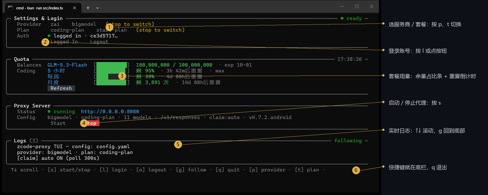
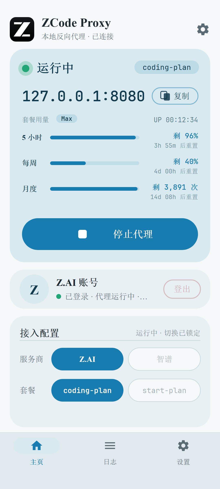
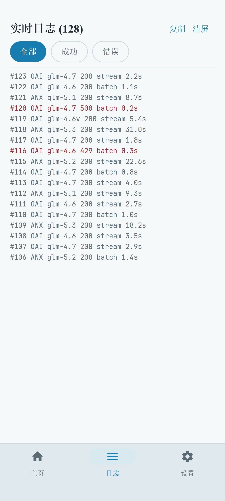
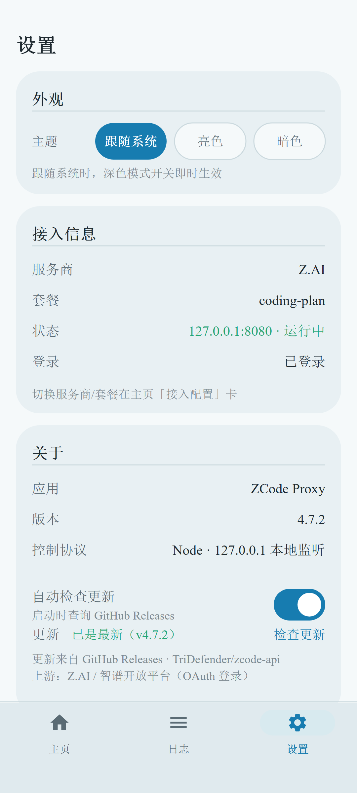
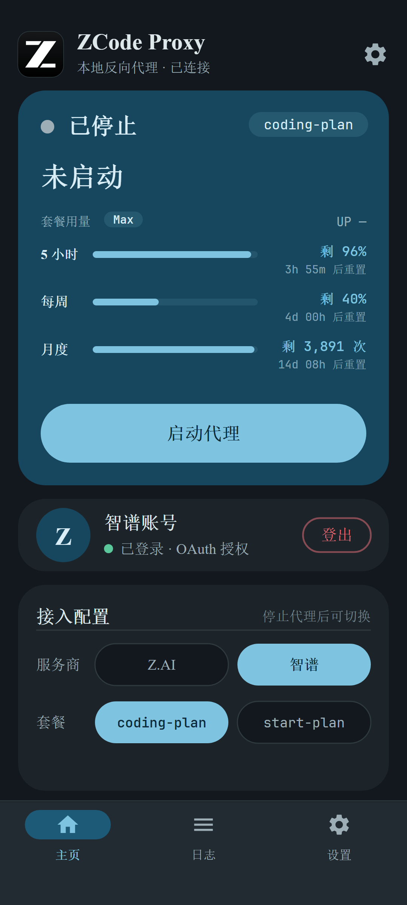

<div align="center">


# ZCode Proxy

**Plug your GLM coding plan into every AI coding tool.**

A small tool that runs on your own machine: Zhipu Z.AI / Bigmodel coding plans (personal plan / trial plan)
normally only work inside the official client. ZCode Proxy exposes them locally as standard OpenAI / Anthropic APIs,
so Claude Code, Codex, Silly Tavern ... can all use your plan quota directly.

[Quick start](#-one-minute-quickstart) · [Connect coding tools](#-connect-your-coding-tools) · [Mobile](#-mobile-android) · [FAQ](#-faq)

</div>

---

## What it does for you

- 🧩 **One address, three formats** —— OpenAI, Anthropic, and Responses (Codex-only) APIs all served locally on `127.0.0.1:8080`; use whichever format your tool speaks.
- 🖥️ **Visual panel included** —— launching in a terminal opens a visual panel (headless mode also available); start, log in, and read logs with clicks, or manage from your phone.
- 📱 **Android app** —— start/stop the proxy on your phone, watch live logs, switch providers, handy when away from your desk.
- 💬 **Built-in web chat** —— open `/webui` for a local ChatGPT-style chat page to test models quickly.
- 🌙 **Idle channel & instant plan claiming** (optional) —— a free off-peak compute channel plus automatic claiming of limited trial plans, both built in.
- 🔀 **Hybrid plan auto-switch** (optional) —— holding both a trial start-plan and a personal coding-plan? The proxy spends the expiring trial credits first and falls back to the coding plan automatically when they run out (`planAutoSwitch`).
- 🔌 **In-plan MCP relay** —— relays ZCode official plugin MCPs (Tianyancha / Wind / Tonghuashun iFinD ...) to local `/mcp/*` (requires coding-plan login, `GET /mcp` lists them); the built-in web chat can also attach your own MCP servers as model tools.
- 🪟 **All platforms** —— Windows / macOS / Linux from one codebase; also compiles to a single-file binary or Docker deployment.

## 🚀 One-minute quickstart

### Step 1: Download the latest `exe` from [GitHub Releases](https://github.com/TriDefender/zcode-api/releases)

Yes, that is all — it really is that simple.

After launch you enter the terminal control panel (this is the main UI):



The panel has four cards: **Login & settings** (provider / plan / login), **Plan usage** (remaining-ratio bar + reset countdown, press <kbd>r</kbd> or click Refresh), **Proxy service** (start/stop / current config), **Logs** (one line per request, live scrolling; each row shows the serving plan and human-readable durations such as `13.0s` / `1m0s`). Press <kbd>s</kbd> to start the proxy; once you see `Status: running` you are ready.

> Prefer not to use keyboard shortcuts? Buttons on the panel support **mouse clicks**. Want it to run silently in the background? `zcode-proxy.exe --cli serve`.

### Panel shortcuts

| Key                                                       | Action                                                                                      |
|-----------------------------------------------------------|---------------------------------------------------------------------------------------------|
| <kbd>s</kbd>                                              | Start / stop proxy                                                                          |
| <kbd>l</kbd>                                              | Log in to current provider (opens browser for authorization)                                |
| <kbd>L</kbd>                                              | bigmodel paste login (fallback mode; `l` login itself needs no callback and works headless) |
| <kbd>o</kbd>                                              | Log out                                                                                     |
| <kbd>p</kbd> / <kbd>t</kbd>                               | Switch provider (Z.AI ↔ Bigmodel) / plan (coding-plan ↔ start-plan)                         |
| <kbd>r</kbd>                                              | Refresh plan usage                                                                          |
| <kbd>↑</kbd><kbd>↓</kbd> / <kbd>PgUp</kbd> / <kbd>g</kbd> | Scroll logs / jump to bottom                                                                |
| <kbd>c</kbd>                                              | Clear log screen                                                                            |
| <kbd>q</kbd>                                              | Quit panel                                                                                  |

## 🔌 Connect your coding tools

Once the proxy is running, the local address is **`http://127.0.0.1:8080`**. Your tool only needs two changes: **base URL** and **model name**.

About "API Key": if you set `auth.proxyApiKey` in config (or env var `ZCODE_PROXY_API_KEY`), enter the same value in your tool; if unset, any value (e.g. `sk-1234`) works — local use is not validated.

<details>
<summary><b>Claude Code</b> (click to expand)</summary>

Environment variables for one shell session:

```bash
# macOS / Linux
export ANTHROPIC_BASE_URL=http://127.0.0.1:8080
export ANTHROPIC_AUTH_TOKEN=sk-1234
export ANTHROPIC_MODEL=glm-4.7
claude
```

```powershell
# Windows PowerShell
$env:ANTHROPIC_BASE_URL = "http://127.0.0.1:8080"
$env:ANTHROPIC_AUTH_TOKEN = "sk-1234"
$env:ANTHROPIC_MODEL = "glm-4.7"
claude
```

Or apply it permanently to every Claude Code session through `~/.claude/settings.json` (same variables, no shell changes needed):

```json
{
  "env": {
    "ANTHROPIC_BASE_URL": "http://127.0.0.1:8080",
    "ANTHROPIC_AUTH_TOKEN": "sk-1234",
    "ANTHROPIC_MODEL": "glm-4.7"
  }
}
```

</details>

<details>
<summary><b>Codex CLI</b> (via Responses API)</summary>

Edit `~/.codex/config.toml`:

```toml
model_provider = "zcode"
model = "glm-5.3"

[model_providers.zcode]
name = "ZCode Proxy"
base_url = "http://127.0.0.1:8080/v1"
wire_api = "responses"
env_key = "ZCODE_API_KEY"   # any non-empty value works unless you set a proxy key
```

</details>

<details>
<summary><b>Other OpenAI-compatible tools</b> (Cherry Studio, Kilo Code, Cline, LobeChat...)</summary>

In the tool's "Custom Provider" settings enter:

| Setting                | Value                                                         |
|------------------------|---------------------------------------------------------------|
| API address (Base URL) | `http://127.0.0.1:8080/v1`                                    |
| API Key                | Your proxy key (any value if unset)                           |
| Model                  | `glm-4.7`, `glm-5.3`, `glm-4.6v`, etc., see model table below |

For Anthropic-format tools (e.g. some Claude clients) set the address to `http://127.0.0.1:8080`; the `/v1/messages` path is handled automatically.

</details>

Want to try it manually first? Open **http://127.0.0.1:8080/webui** for the built-in chat page; or use curl:

```bash
curl http://127.0.0.1:8080/v1/chat/completions -H "Content-Type: application/json" -d '{
  "model": "glm-5.3-flash",
  "messages": [{"role": "user", "content": "Hello!"}]
}'
```

## 📱 Mobile (Android)

Download the latest `apk` from [GitHub Releases](https://github.com/TriDefender/zcode-api/releases) and install.
The app mirrors the desktop features: one-tap proxy start, simple setup, live logs, provider & plan switching, light/dark themes.

|                                  Home                                   |                               Logs                                |                                 Settings                                  |                                  Dark theme                                  |
|:-----------------------------------------------------------------------:|:-----------------------------------------------------------------:|:-------------------------------------------------------------------------:|:----------------------------------------------------------------------------:|
|  |  |  |  |

Phone and desktop run the same core: the app embeds the full proxy engine, **the phone itself is a standalone proxy server**, and desktops on the same LAN can also use the proxy address on the phone.

<details>
<summary><b>Docker deployment</b></summary>

**Easiest way — Compose from this repo.** Everything persistent lives in `./docker-data/` (config + credentials), the proxy is reachable on `http://127.0.0.1:8080`, and log timestamps render in Europe/Istanbul time:

```bash
git clone https://github.com/KilimcininKorOglu/zcode-api && cd zcode-api
mkdir -p docker-data
echo 'ZCODE_PROXY_CREDENTIAL_SECRET=a-secret-passphrase-only-you-know' > .env

# Log in once (no browser needed on the server: open the printed link on any
# device and the login completes automatically). The credential is stored in
# docker-data/credentials.json and survives container recreation.
docker compose run --rm zcode-proxy bun run src/index.ts auth login zai

docker compose up -d --build
```

Tune the running container through `docker-data/config.yaml` (auto-created on first start, fully commented): set `planAutoSwitch: true` there for the hybrid plan auto-switch, then `docker compose restart`. Updating later is `git pull && docker compose up -d --build` (build + recreate in one command).

**Or use the prebuilt image** without cloning (multi-arch amd64 / arm64, runs as `bun` user):

```bash
# Log in on the host with a fixed encryption seed (both providers are callback-free: open the link on any device and login completes automatically)
ZCODE_PROXY_CREDENTIAL_SECRET="a-secret-passphrase-only-you-know" \
  bun run src/index.ts auth login zai

docker run -d --name zcode-proxy -p 8080:8080 \
  -v "$(pwd)/config.yaml:/data/config.yaml:ro" \
  -v "$(HOME)/.zcode-proxy/credentials.json:/home/bun/.zcode-proxy/credentials.json:ro" \
  -e ZCODE_PROXY_CREDENTIAL_SECRET="a-secret-passphrase-only-you-know" \
  ghcr.io/tridefender/zcode-proxy:latest
```

```yaml
services:
  zcode-proxy:
    image: ghcr.io/tridefender/zcode-proxy:latest
    ports: ["8080:8080"]
    volumes:
      - ./config.yaml:/data/config.yaml:ro
      - ./credentials.json:/home/bun/.zcode-proxy/credentials.json:ro
    environment:
      ZCODE_PROXY_CREDENTIAL_SECRET: "a-secret-passphrase-only-you-know"
    restart: unless-stopped
```

</details>

<details>
<summary><b>Tunable config & environment variables</b> (works untouched)</summary>

The config file is `config.yaml` in the project root (auto-generated on first launch, fully commented — see [`config.example.yaml`](config.example.yaml)); environment variables take precedence. Common ones:

| Env var                         | Default          | Description                                                                                                                      |
|---------------------------------|------------------|----------------------------------------------------------------------------------------------------------------------------------|
| `ZCODE_PROXY_PORT`              | `8080`           | Listen port                                                                                                                      |
| `ZCODE_PROXY_API_KEY`           | none             | Key clients use to access the proxy (unset = no check)                                                                           |
| `ZCODE_PROVIDER`                | `zai`            | Provider `zai` / `bigmodel`                                                                                                      |
| `ZCODE_PLAN_AUTO_SWITCH`        | off              | Set to `1`/`true` for the hybrid plan auto-switch (`planAutoSwitch`): prefer the start-plan entitlement while it has balance, fall back to the coding plan when it runs out |
| `ZCODE_BATCH_AS_STREAM`         | on               | Set to `0`/`false` to disable `batchAsStream`: batch (non-streaming) requests are sent upstream as streams and reassembled into one JSON, because the upstream gateway kills silent non-streaming requests past ~180s (symptom: 502 after exactly ~3 minutes) |
| `ZCODE_PROXY_CONFIG`            | `config.yaml`    | Config file path                                                                                                                 |
| `ZCODE_PROXY_CREDENTIAL_SECRET` | machine-specific | Encryption seed for login credentials (pin it for cross-machine moves / Docker)                                                  |
| `ZCODE_LOG_FORMAT`              | desktop table    | Set to `compact` for single-line logs (narrow screens)                                                                           |
| `ZCODE_PANEL_ENABLED`           | off              | Set to `1`/`true` so headless `serve` mode (incl. Docker) also starts a local web panel                                          |
| `ZCODE_PANEL_TOKEN`             | none             | Panel access token, **required when the panel is enabled** (panel refuses to start without one, to avoid an exposed control API) |
| `ZCODE_PANEL_PORT`              | `8090`           | Panel port (binds `127.0.0.1` only)                                                                                              |
| `ZCODE_UPDATE_CHECK`            | on               | Set to `off`/`0` to disable the "new version available" check at startup (notify-only, never auto-updates)                       |
| `ZCODE_UPDATE_SKIP`             | none             | Comma-separated versions to ignore, e.g. `v4.7.6,v4.7.7`                                                                         |
| `ZCODE_ERROR_LOG`               | `<config dir>/errors.log` | Persistent JSONL failure log: one line per client-visible 4xx/5xx plus the failure-reason events behind it (retries, aborts, stream failures). Entries carry the per-boot request id (`a1b2-#007`) and, when the client/upstream sent them, the client's request/session id and the upstream's `x-request-id` for correlation. Past 5 MB it rotates to `errors.log.1` |

Plan type (`plan`: `coding-plan` personal / `start-plan` trial) can be toggled with <kbd>t</kbd> in the panel and is written back to config.yaml.

**Editing config.yaml without a restart**: the running proxy watches the file and applies edits in place (watch for the `[config] reloaded: ...` log line). Flipping `claim.auto`, `planAutoSwitch` or `plan` also starts or stops the matching background job; a broken file keeps the running config and stays watching. Only `server` (port/host) needs a restart.

For servers without a TUI, use a browser instead: set `ZCODE_PANEL_ENABLED=1` and `ZCODE_PANEL_TOKEN=<your-own-random-string>`, start, then forward `http://127.0.0.1:8090` over SSH — you can view status and quota, switch provider/plan, log in/out, watch live logs and the MCP list. The panel binds loopback only, requires the token on every API call, and never starts without a token; commands are dispatched in-process so no extra control port is opened. "Stop proxy" on the panel only stops the proxy — the process itself still exits cleanly (SIGTERM/SIGINT and panel shutdown both clear background timers — auto-claim, captcha pool — before exit); logging out from the panel also clears the running credential and stops the proxy so new requests cannot keep spending the old account's quota.

**New-version notice**: `serve` and TUI check GitHub's latest release once asynchronously at startup — at most one extra log line (press <kbd>u</kbd> in the TUI to re-check manually); it never blocks startup or affects the proxy; offline / blocked / rate-limited / changed response shapes are all silently ignored. Manual checks always give a definite answer ("already latest" or "check unavailable"). Inside containers the image is immutable, so the hint shows the **pull command for your runtime** (Docker: `docker compose pull && docker compose up -d`, Podman: `podman compose pull && podman compose up -d`; otherwise just "pull the new image and recreate the container") instead of replacing files in place (releases ship no checksums, so no auto-download replacement). Set `ZCODE_UPDATE_CHECK=off` to disable checks, or `ZCODE_UPDATE_SKIP=v4.7.6` to silence a noisy version.

**Reaching the panel inside Docker**: the panel listens only on the **container's own** `127.0.0.1`, so on default bridge networking `-p 8080:8080` cannot expose it — adding `-p 8090:8090` alone still fails (the port maps to the container's non-loopback address). On a Linux server use host networking so the container shares the host loopback:

```yaml
services:
  zcode-proxy:
    # keep existing image / volumes / restart etc.
    network_mode: host        # remove the old ports: in host mode
    environment:
      ZCODE_PROXY_CREDENTIAL_SECRET: "a-secret-passphrase-only-you-know"
      ZCODE_PANEL_ENABLED: "1"
      ZCODE_PANEL_TOKEN: "${ZCODE_PANEL_TOKEN:?please set the panel token in .env first}"
      ZCODE_PANEL_PORT: "8090"
```

Then create a forward-only tunnel locally (`-N` = no shell):

```bash
ssh -N -L 8090:127.0.0.1:8090 user@host
```

Then open `http://127.0.0.1:8090`. In host mode the main proxy port also occupies the host port directly, so keep allowing 8080 in security-group/firewall rules as before, and **do not** expose 8090 publicly.

</details>

<details>
<summary><b>Advanced features: idle channel, plan claiming & auto-switch</b></summary>

**Idle channel (`/async/*`)** —— free compute released by the vendor during off-peak hours such as late night. Requests queue for a ticket first and are sent to the model automatically when it is their turn (good for unhurried batch jobs). Enable with `async.enabled: true` in `config.yaml`; note it is one-shot with no session memory — include history in the request for multi-turn chats.

**Weekend/trial plan auto-claim (claim)** —— enabled by default. Every 5 minutes the proxy probes the vendor's limited plan campaign page and auto-claims for you the moment a new offer drops (`claim.enabled: false` disables it). Manual claim: `bun run src/index.ts claim`.

**Hybrid plan auto-switch (`planAutoSwitch`)** —— pairs with auto-claim. Accounts can hold both a trial start-plan (points bucket, expires) and a personal coding-plan (rolling windows, resets). Off by default the static `plan` config applies as-is; with `planAutoSwitch: true` in config (or `ZCODE_PLAN_AUTO_SWITCH=1`), a background watcher polls `billing/balance` every 5 minutes and routes requests to the start-plan while it still has unexpired balance. If the start-plan gateway rejects a request (401/402/403, HTTP 200 carrying a JSON error envelope — the shape exhaustion takes in the wild, or the start-plan gateway itself failing with 502/504), the same request is retried once on the coding plan and start-plan cools down for 10 minutes until the watcher sees balance again — so trial credits are never wasted, and coding-plan requests are never blocked by a broken trial tier. Separately from the plan tiers, a complete upstream load-balancer failure (502/504) is retried once before it can reach the client. The TUI plan card shows the tier requests actually use with an `(auto)` marker, and the request log row carries a Plan column (`start-plan` / `coding-plan`).

**Quota display (quota)** —— after login the panel queries quota once automatically, then press <kbd>r</kbd> to refresh manually. Data comes from two upstream quota planes: the points bucket for trial/points-based plans (`billing/balance`, remaining / total, expiry), and the usage window for personal coding plans (`/api/monitor/usage/quota/limit`, same source as the official usage panel, **remaining quota** and reset time for the 5-hour / weekly windows — upstream `number` is not a comparable total, so CLI/TUI consistently show only the remainder and draw a ratio bar only when upstream provides a percentage). Query from CLI directly: `bun run src/index.ts quota` (HTTP equivalent `GET /quota`). Note upstream gateways rate-limit frequent queries, so the panel does no timed polling.

</details>

## 🧮 Available models

The proxy lists these models on `/v1/models` (the list is presentational only — other model names are forwarded as-is):

| Model                       | Context | Max output |
|-----------------------------|---------|------------|
| `glm-4.5-air`               | 131K    | 96K        |
| `glm-4.6`                   | 200K    | 131K       |
| `glm-4.6v` (vision)         | 131K    | 32K        |
| `glm-4.7`                   | 200K    | 131K       |
| `glm-5` / `glm-5-turbo`     | 200K    | 64K        |
| `glm-5v-turbo` (vision)     | 200K    | 131K       |
| `glm-5.1`                   | 200K    | 64K        |
| `glm-5.2`                   | 1M      | 128K       |
| `glm-5.3` / `glm-5.3-flash` | 1M      | 128K       |

## ❓ FAQ

**Exits immediately with "Not logged in"?**
Log in first: `bun run src/index.ts auth login zai` (or bigmodel). One login is enough; credentials are stored encrypted.

**Port 8080 already taken?**
Switch with an env var: `ZCODE_PROXY_PORT=8081 bun run src/index.ts`, or change `server.port` in `config.yaml`.

**Tool cannot connect / 401?**
If you set `ZCODE_PROXY_API_KEY`, the tool must use the same value; with it unset there is no password. Note that once a key is enabled, **all routes** except `/webui` (including `/health`) require it.

**Do I need to log in again after switching computers / reinstalling the OS?**
Yes. Credentials are encrypted bound to the local machine. To migrate, set `ZCODE_PROXY_CREDENTIAL_SECRET` to the same value on both sides, then log in again / copy `~/.zcode-proxy/credentials.json`.

**How do I log in on a server with no browser?**
Just log in directly: `bun run src/index.ts auth login zai` (or bigmodel). The login link can be opened in a browser on any device and the local machine completes automatically (no callback page needed). For manual exchange there is also paste mode: `auth login bigmodel --paste` — paste back the full redirected URL.

**What does it do in the background?**
It is just a "translator + messenger": it translates your tool's standard requests into the same requests the official client sends, forwards them upstream, then translates the replies back verbatim. All traffic stays between your machine and the official servers — no third party in between.

## 🛠️ Contributing

```bash
bun test            # run tests
bun x tsc --noEmit  # typecheck
bun run dev         # start panel in dev mode
```

Architecture and implementation details are documented in comments inside each source file under [`src/`](src/).

## Privacy

This proxy runs fully locally: **no telemetry, no analytics, no outbound reporting of any kind**. Your usage data, device info, and config never leave your machine; debug/dump logs automatically redact API keys, JWTs, and proxy keys.

## License

MIT
